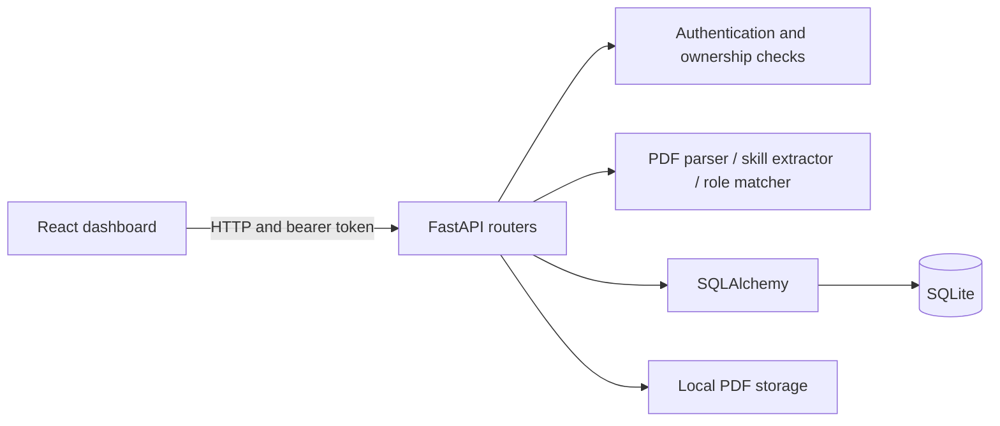

# AI Career Assistant

A Python and React learning project: upload a PDF resume, extract its text,
detect software-skill mentions, and compare them with illustrative role profiles.
Matching uses local rules. No LLM or external AI API is currently used.

## Current features

- Registration, bcrypt password hashing, JWT login and personal dashboard.
- PDF upload, local file storage and extracted text saved in SQLite.
- Owner-protected resume lists, text, detected skills and example role overlaps.
- Per-role skill review checklists with temporary progress and truthful resume guidance.
- Compare an uploaded resume with pasted job-description text using catalog skill overlap.
- Review tentative requirement labels and their source wording alongside the comparison.
- Choose temporary requirement labels while keeping automatic labels and scores visible.
- Download a JSON comparison summary containing results, source excerpts and your choices.
- React loading, retry, empty-state and session-error feedback.

Role percentages measure keyword overlap with four authored example profiles,
not qualification or hiring probability. They are not live job listings.

## Architecture



| Location | Responsibility |
| --- | --- |
| `backend/app/routers/` | HTTP endpoints and ownership checks |
| `backend/app/services/` | PDF parsing, skill extraction and role scoring |
| `backend/app/models.py` / `schemas.py` | Database structure / API contracts |
| `backend/app/security.py` / `oauth2.py` | Password hashing / token authentication |
| `frontend/src/components/` | Forms, dashboard and resume panels |
| `frontend/src/services/api.js` | Requests, response validation and errors |
| `backend/tests/` / `backend/evaluation/` | Tests / synthetic matcher evaluation |

## Setup: Windows PowerShell

Tested environment: Python 3.12 and Node.js 24 with npm. Git is needed to clone;
Google Chrome is needed for the optional browser test. A fresh Python environment and isolated frontend install/build were verified on
the current Windows machine. GitHub Windows/Ubuntu backend checks and Ubuntu frontend checks also passed;
a deployment host remains unverified.

### Clone

```powershell
git clone https://github.com/Vamshinethula/ai-career-assistant.git
cd ai-career-assistant
```

### Backend: first terminal, starting at the project root

```powershell
cd backend
py -3.12 -m venv .venv
.\.venv\Scripts\python.exe -m pip install -r requirements.txt
.\.venv\Scripts\python.exe scripts/init_local_env.py
.\.venv\Scripts\python.exe scripts/migrate_database.py
.\.venv\Scripts\python.exe -m uvicorn app.main:app --reload
```

For an existing setup, install changed requirements and run the migration command
once before starting the server. On ordinary restarts, run only the last command
from `backend/`. Calling its
Python directly avoids requiring virtual-environment activation. Keep the
terminal running. Check [health](http://127.0.0.1:8000/health) and
[interactive API docs](http://127.0.0.1:8000/docs).

The setup script creates a random JWT signing key in ignored `backend/.env`
without printing it or overwriting an existing file. Keep that file private.
The application reads this exact file regardless of the working directory;
an environment variable named `JWT_SECRET_KEY` takes precedence. A missing,
blank or shorter-than-32-byte key prevents startup. Use a randomly generated key,
not merely a long memorable phrase. `.env.example` documents the variable.
Changing the key invalidates old tokens; restart the backend and log in again.
Account passwords and resumes are unaffected.

The database and uploads default to the backend directory regardless of working
directory; run the documented commands from `backend/`. Startup
requires the current Alembic revision. The migration command creates a fresh database
or adopts a matching existing schema without deleting rows. Back up existing databases
before migration; see [migration workflow](backend/migrations/README.md). A schema
mismatch stops adoption for inspection. Keep existing databases and uploads.

### Frontend: second terminal, starting at the project root

```powershell
cd frontend
npm.cmd ci
npm.cmd run dev -- --host 127.0.0.1 --port 5173 --strictPort
```

Skip `npm.cmd ci` on subsequent starts unless dependencies changed. Open
[the app](http://127.0.0.1:5173/). Both servers are needed. Reuse servers already
running on their ports; `Ctrl+C` stops a server in its terminal.

## Try the application

1. Register and log in. New passwords must be nonempty, have no null characters,
   and fit within 72 UTF-8 bytes; some characters use more than one byte.
2. Upload a PDF with selectable text, up to 5 MiB and 10 pages, without password protection. Confirm its filename appears.
3. Open **View text**, **View skills** and **View role overlaps**.
4. Compare the results with the PDF, then log out.

Under a role, open **Review next steps** to review terms not detected in your
resume. Check a box after reviewing that term; this does not change the role
score or certify a skill. Progress clears when role overlaps close, you switch
resumes, refresh, or log out. No checklist data is saved to the server.

Choose **Compare job description**, paste up to 10,000 characters, and click
**Compare skills**. With the sample resume above, `Python Docker Kubernetes`
returns 66.7% overlap and Kubernetes not detected in the resume. No catalog
matches produces an explanation without a score. Editing clears stale results;
closing the comparison clears unsaved text and results. Job text is persisted only
when you explicitly save a comparison; it is not sent to an external AI service. Keyword detection does not
distinguish required, optional, or negated mentions and is not a hiring prediction.

After comparison, **Download comparison summary** saves a readable JSON file.
It includes automatic labels, separate user choices, evidence and limitations.
It excludes resume text and authentication tokens, but source excerpts may
contain private job-description text. Review before sharing. Files remain on
your device after logout; this version does not import summaries back into the app.

A PDF containing `Python FastAPI SQL Git Docker` should produce those five
skills and 100% overlap with the illustrative Python backend profile.
Refreshing the page clears the current in-memory login.

The first public deployment will be a disposable synthetic demo. Its frontend
uses `npm run build:demo` to show data-reset and synthetic-data guidance.
`npm run dev:demo` previews that mode locally; it does not clear any local data.
See [hosting plan](HOSTING_PLAN.md) for configuration and isolated verification.

## API reference

Base URL: `http://127.0.0.1:8000`. Request schemas are in `/docs`.

| Method | Path | Purpose | Success |
| --- | --- | --- | --- |
| POST | `/auth/register` | Create account from JSON | 201 |
| POST | `/auth/login` | Obtain token using JSON credentials | 200 |
| GET | `/users/me` | Authenticated profile | 200 |
| POST | `/resumes/upload` | PDF in form-data field `resume_file` | 201 |
| GET | `/resumes` | Current user's resume list | 200 |
| GET | `/resumes/{resume_id}` | Resume metadata and text | 200 |
| GET | `/resumes/{resume_id}/skills` | Detected catalog terms | 200 |
| GET | `/resumes/{resume_id}/matches` | Illustrative role overlaps | 200 |
| POST | `/resumes/{resume_id}/compare-job` | Compare pasted job-description skills | 200 |

User/resume routes require authentication. In Postman select **Authorization →
Bearer Token** and paste only the token. GET requests need no body. For uploads,
select **Body → form-data**, enter `resume_file`, change its type to **File**,
and choose a PDF.

Replace `{resume_id}` with a numeric ID. First call `GET /resumes`, then use a
row's `id`, not `user_id`. If it is 3, request
`http://127.0.0.1:8000/resumes/3/matches`.

For job comparison, POST to `/resumes/3/compare-job` (replace 3 with your own
resume ID), use the same bearer token and Body -> raw -> JSON:

```json
{"job_description": "Python Docker Kubernetes"}
```

Blank/over-limit descriptions return 422; another user's resume returns 404.
The response includes source excerpts for tentative required, optional, explicitly
not-required and uncertain labels. Excerpts can include the full input in fallback
cases. Comparison alone is transient; the separate save action persists text and results. A null overlap score means
missing readable resume text or no catalog terms in the job description.

Expected failures: missing/invalid authentication `401`, foreign/missing resume
`404`, duplicate email `409`, invalid input `422`, invalid/empty/corrupt or
password-protected PDF `400`, and byte/page-limit rejection `413`. Tested cleanup
removes rejected files/records; unexpected server/storage failures remain `500`.

## Tests and evaluation

From **`backend/`**:

```powershell
.\.venv\Scripts\python.exe -m unittest discover -s tests -q
.\.venv\Scripts\python.exe -m evaluation.evaluate_skills
.\.venv\Scripts\python.exe -m evaluation.evaluate_jobs
.\.venv\Scripts\python.exe -m evaluation.evaluate_requirements
```

Current locally verified suite: **77 passing backend tests**, including job
comparison and offline backup recovery tests. Remote CI for commit e933920 passed all 74 backend tests on Windows/Ubuntu and the 3 frontend export tests on Ubuntu.
Evaluation reports both
supported examples and known limitations using synthetic development cases;
see [evaluation details](backend/evaluation/README.md).

From **`frontend/`**:

```powershell
npm.cmd run build
npm.cmd run lint
npm.cmd test
```

From the **project root**:

```powershell
node backend/tests/browser_smoke.mjs
```

Already in **`backend/`**? Use `node tests/browser_smoke.mjs` instead. Expect
a `PASS` summary. See [browser test setup](backend/tests/BROWSER_TEST.md) for
Chrome paths, ports and test isolation. The real-browser check passed for
password validation, registration/login, upload/results, network retry and logout.
It is not a comprehensive visual/accessibility audit.

## Current limitations

- Local learning MVP. JWT signing key comes from environment/private `.env`;
  use deployment secret storage before publishing. The old development key is
  retired but remains in historical Git commits; never reuse it. Algorithm HS256
  and 30-minute expiration remain fixed. History has not been rewritten.
- API address and CORS origins are configurable; defaults use local ports 8000/5173.
- Login tokens live in React memory. Refresh clears login; logout does not revoke
  an issued JWT. Refresh tokens and password recovery are not implemented.
- Uploads are limited to 5 MiB and 10 pages before application storage/parsing.
  Multipart receipt/spooling happens earlier; deployment request limits, parsing
  time/memory isolation and compressed-content safeguards remain future work.
  No OCR or resume deletion yet. Schema migrations now use Alembic.
  Parsing loads PDF bytes in memory; file and database operations are not atomic
  across crashes or filesystem deletion failures.
- The skill catalog is limited and ignores context/proficiency. Ordinary words
  can match skills; unknown terms are missed. Equal-weight role scores inherit
  these limitations and are based on simplified examples.
- Legacy passwords over 72 bytes retain historical bcrypt truncation during
  login for compatibility. New registrations reject them; hashes were not migrated.

Backend environments, `.env`, databases and uploads, and frontend dependencies
and build output are ignored by Git. Do not commit real resumes or tokens.
Synthetic test credentials/hashes are intentional fixtures, not real accounts.

## Troubleshooting

| Symptom | Check |
| --- | --- |
| Cannot find module under `backend/backend/` | Use the command for your current terminal directory |
| Port already in use | Reuse the existing server; browser tests also need 8001/9223 free |
| Could not reach the server | Confirm FastAPI is running on 8000 |
| 422 for resume ID | Replace the placeholder with an actual numeric resume ID |
| Database needs migration | From backend run `.venv/Scripts/python.exe scripts/migrate_database.py` |
| Existing schema differs from baseline | Keep the database and inspect the mismatch; do not force a stamp |

See [progress](PROGRESS.md), [decisions](DECISIONS.md), [learning log](LEARNING_LOG.md),
[error history](ERRORS_AND_FIXES.md), [roadmap](ROADMAP.md) and
[session handoff](PROJECT_HANDOFF.md).

## API address and browser origins

Local defaults need no extra configuration. To change them:

- Frontend: copy frontend/.env.example to frontend/.env.local and set VITE_API_BASE_URL to the backend HTTP(S) address. Restart Vite after changes; production requires a rebuild. This value is public, so never add JWT secrets or private API keys to VITE_ variables.
- Backend: set CORS_ORIGINS in backend/.env or the process environment to a comma-separated list such as `https://app.example.com`. Use exact frontend origins, without paths or trailing slashes. Restart FastAPI. Process environment overrides the file; omitted setting retains localhost defaults. Empty/malformed settings fail startup.
- Keep the existing JWT_SECRET_KEY when editing backend/.env. CORS limits browser response access; authentication and ownership checks still protect data.

Success: browser login and uploads work from the configured origin. A different origin fails CORS preflight; an incorrect API address produces connection feedback. HTTPS deployments need an HTTPS backend. This checkpoint configures addresses only; hosting, persistent storage and production hardening remain outstanding.

See [deployment readiness and runbook](DEPLOYMENT.md) for hosting requirements, persistent data considerations, release commands and outstanding verification. No hosted deployment has been completed.

## Storage location

Omit CAREER_DATA_DIR to preserve current backend/ storage. For a new storage location,
create an absolute directory and set CAREER_DATA_DIR in backend/.env or the process
environment. Both SQLite and uploads will live beneath it. Run migrations with the
same setting, then restart the backend. Invalid or nonexistent directories fail
rather than silently falling back. No files are moved automatically: a new empty
directory produces an empty database after migration. Do not switch an existing
installation until its database, uploads and saved file paths have a reviewed
migration/backup plan. The existing migration guide's backup example targets the
default backend location; for custom storage use its configured database path.

## Automated checks

[Project checks](.github/CI.md) defines GitHub Actions backend tests/migrations on Windows and Ubuntu plus frontend lint/build on Ubuntu. The [first remote run](https://github.com/Vamshinethula/ai-career-assistant/actions/runs/35131859172) passed all three jobs for commit `1c468db`. It does not deploy the application.

## Reviewed requirement score

In job-comparison results, select Required under Your label for each skill you confirm. The separate score uses only those terms: matched confirmed terms divided by all confirmed terms. It does not use automatic labels as confirmation or change original keyword overlap. No confirmations gives no score; unreviewed/uncertain counts show incomplete coverage. A 100% selected subset is not full job suitability. Choices remain temporary. JSON export v2 includes the reviewed score and its denominator. Locally verified: 7 frontend tests and both browser modes; remote CI evidence above predates this feature.

## Saved comparisons

After comparing and reviewing labels, enter a title and choose Save comparison.
This explicitly stores private job text, backend results and labels. Reopen under
Saved comparisons after logging in again. History is read-only; each save creates
a new snapshot. Unsaved work stays temporary. A disposable demo reset may erase
saved data. Apply migrations before backend startup; current revision is
0002_saved_comparisons. See [saved comparisons](backend/evaluation/SAVED_COMPARISONS.md).

| Method | Path | Result |
| --- | --- | --- |
| POST | /resumes/{resume_id}/comparisons | 201 saved snapshot |
| GET | /resumes/{resume_id}/comparisons | 200 metadata list |
| GET | /resumes/{resume_id}/comparisons/{comparison_id} | 200 saved detail |

All require the owner's bearer token. POST accepts title, job_description and
label_choices. Invalid input returns 422; foreign/missing resources return 404.

Saved snapshots can be deleted from their detail view after confirmation. DELETE `/resumes/{resume_id}/comparisons/{comparison_id}` requires ownership and returns 204; the resume/PDF remain. Latest local checkpoint: 78 backend tests, 7 frontend tests, lint/build and both Chrome modes passed (2026-09-18).

Saved history displays ten entries per page with Newer/Older controls. GET `/resumes/{resume_id}/comparisons` accepts `offset` (default 0) and `limit` (default 20, maximum 100). Latest verification: 79 backend tests, 7 frontend tests, lint/build and both Chrome modes.

Saved history now supports title search and clearing. GET comparisons accepts optional `search` (maximum 120 characters), matching literal substrings before pagination. SQLite case-insensitive matching is primarily ASCII. Latest local checks: 80 backend tests, 7 frontend tests, lint/build and both Chrome modes.

Saved comparison titles can be renamed from the detail view. Owner-protected PATCH updates only the title. Latest checkpoint: 81 backend tests, 7 frontend tests, lint/build and both browser modes passed.
