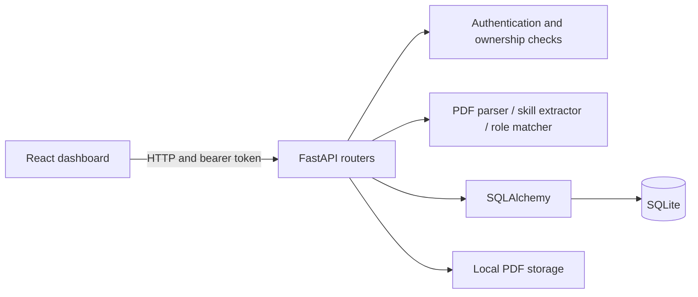

# AI Career Assistant

A Python and React learning project: upload a PDF resume, extract its text,
detect software-skill mentions, and compare them with illustrative role profiles.
Matching uses local rules. No LLM or external AI API is currently used.

## Current features

- Registration, bcrypt password hashing, JWT login and personal dashboard.
- PDF upload, local file storage and extracted text saved in SQLite.
- Owner-protected resume lists, text, detected skills and example role overlaps.
- React loading, retry, empty-state and session-error feedback.

Role percentages measure keyword overlap with four authored example profiles,
not qualification or hiring probability. They are not live job listings.

## Architecture



| Location | Responsibility |
| --- | --- |
| `backend/app/routers/` | HTTP endpoints and ownership checks |
| `backend/app/services/` | PDF parsing, skill extraction and role scoring |
| `backend/app/models.py` / `schemas.py` | Database structure / API contracts |
| `backend/app/security.py` / `oauth2.py` | Password hashing / token authentication |
| `frontend/src/components/` | Forms, dashboard and resume panels |
| `frontend/src/services/api.js` | Requests, response validation and errors |
| `backend/tests/` / `backend/evaluation/` | Tests / synthetic matcher evaluation |

## Setup: Windows PowerShell

Tested environment: Python 3.12 and Node.js 24 with npm. Git is needed to clone;
Google Chrome is needed for the optional browser test. A clean-machine dependency
installation has not been verified in this documentation checkpoint.

### Clone

```powershell
git clone https://github.com/Vamshinethula/ai-career-assistant.git
cd ai-career-assistant
```

### Backend: first terminal, starting at the project root

```powershell
cd backend
py -3.12 -m venv .venv
.\.venv\Scripts\python.exe -m pip install -r requirements.txt
.\.venv\Scripts\python.exe scripts/init_local_env.py
.\.venv\Scripts\python.exe -m uvicorn app.main:app --reload
```

For an existing setup, run only the last command from `backend/`. Calling its
Python directly avoids requiring virtual-environment activation. Keep the
terminal running. Check [health](http://127.0.0.1:8000/health) and
[interactive API docs](http://127.0.0.1:8000/docs).

The setup script creates a random JWT signing key in ignored `backend/.env`
without printing it or overwriting an existing file. Keep that file private.
The application reads this exact file regardless of the working directory;
an environment variable named `JWT_SECRET_KEY` takes precedence. A missing,
blank or shorter-than-32-byte key prevents startup. Use a randomly generated key,
not merely a long memorable phrase. `.env.example` documents the variable.
Changing the key invalidates old tokens; restart the backend and log in again.
Account passwords and resumes are unaffected.

The database and upload paths are relative, so start from `backend/`. Startup
creates a new database if absent. It does not migrate old tables. Keep existing
databases/uploads; inspect missing-column errors rather than deleting data.

### Frontend: second terminal, starting at the project root

```powershell
cd frontend
npm.cmd ci
npm.cmd run dev -- --host 127.0.0.1 --port 5173 --strictPort
```

Skip `npm.cmd ci` on subsequent starts unless dependencies changed. Open
[the app](http://127.0.0.1:5173/). Both servers are needed. Reuse servers already
running on their ports; `Ctrl+C` stops a server in its terminal.

## Try the application

1. Register and log in. New passwords must be nonempty, have no null characters,
   and fit within 72 UTF-8 bytes; some characters use more than one byte.
2. Upload a disposable PDF with selectable text and confirm its filename appears.
3. Open **View text**, **View skills** and **View role overlaps**.
4. Compare the results with the PDF, then log out.

A PDF containing `Python FastAPI SQL Git Docker` should produce those five
skills and 100% overlap with the illustrative Python backend profile.
Refreshing the page clears the current in-memory login.

## API reference

Base URL: `http://127.0.0.1:8000`. Request schemas are in `/docs`.

| Method | Path | Purpose | Success |
| --- | --- | --- | --- |
| POST | `/auth/register` | Create account from JSON | 201 |
| POST | `/auth/login` | Obtain token using JSON credentials | 200 |
| GET | `/users/me` | Authenticated profile | 200 |
| POST | `/resumes/upload` | PDF in form-data field `resume_file` | 201 |
| GET | `/resumes` | Current user's resume list | 200 |
| GET | `/resumes/{resume_id}` | Resume metadata and text | 200 |
| GET | `/resumes/{resume_id}/skills` | Detected catalog terms | 200 |
| GET | `/resumes/{resume_id}/matches` | Illustrative role overlaps | 200 |

User/resume routes require authentication. In Postman select **Authorization →
Bearer Token** and paste only the token. GET requests need no body. For uploads,
select **Body → form-data**, enter `resume_file`, change its type to **File**,
and choose a PDF.

Replace `{resume_id}` with a numeric ID. First call `GET /resumes`, then use a
row's `id`, not `user_id`. If it is 3, request
`http://127.0.0.1:8000/resumes/3/matches`.

Expected failures: missing/invalid authentication `401`, foreign/missing resume
`404`, duplicate email `409`, invalid input `422`, non-PDF `400`. Corrupt PDFs
currently return `500`; tested cleanup removes incomplete files/records.

## Tests and evaluation

From **`backend/`**:

```powershell
.\.venv\Scripts\python.exe -m unittest discover -s tests -q
.\.venv\Scripts\python.exe -m evaluation.evaluate_skills
```

Current verified suite: **44 passing backend tests**. Evaluation reports both
supported examples and known limitations using synthetic development cases;
see [evaluation details](backend/evaluation/README.md).

From **`frontend/`**:

```powershell
npm.cmd run build
npm.cmd run lint
```

From the **project root**:

```powershell
node backend/tests/browser_smoke.mjs
```

Already in **`backend/`**? Use `node tests/browser_smoke.mjs` instead. Expect
a `PASS` summary. See [browser test setup](backend/tests/BROWSER_TEST.md) for
Chrome paths, ports and test isolation. The real-browser check passed for
password validation, registration/login, upload/results, network retry and logout.
It is not a comprehensive visual/accessibility audit.

## Current limitations

- Local learning MVP. JWT signing key comes from environment/private `.env`;
  use deployment secret storage before publishing. The old development key is
  retired but remains in historical Git commits; never reuse it. Algorithm HS256
  and 30-minute expiration remain fixed. History has not been rewritten.
- Frontend API address is fixed at port 8000; CORS allows local origins on 5173.
- Login tokens live in React memory. Refresh clears login; logout does not revoke
  an issued JWT. Refresh tokens and password recovery are not implemented.
- No upload size/page limits, OCR, resume deletion or schema migrations yet.
  Parsing loads PDF bytes in memory; file and database operations are not atomic
  across crashes or filesystem deletion failures.
- The skill catalog is limited and ignores context/proficiency. Ordinary words
  can match skills; unknown terms are missed. Equal-weight role scores inherit
  these limitations and are based on simplified examples.
- Legacy passwords over 72 bytes retain historical bcrypt truncation during
  login for compatibility. New registrations reject them; hashes were not migrated.

Backend environments, `.env`, databases and uploads, and frontend dependencies
and build output are ignored by Git. Do not commit real resumes or tokens.
Synthetic test credentials/hashes are intentional fixtures, not real accounts.

## Troubleshooting

| Symptom | Check |
| --- | --- |
| Cannot find module under `backend/backend/` | Use the command for your current terminal directory |
| Port already in use | Reuse the existing server; browser tests also need 8001/9223 free |
| Could not reach the server | Confirm FastAPI is running on 8000 |
| 422 for resume ID | Replace the placeholder with an actual numeric resume ID |
| Missing database column | Inspect the existing schema; `create_all()` does not migrate tables |

See [progress](PROGRESS.md), [decisions](DECISIONS.md), [learning log](LEARNING_LOG.md),
[error history](ERRORS_AND_FIXES.md), [roadmap](ROADMAP.md) and
[session handoff](PROJECT_HANDOFF.md).
